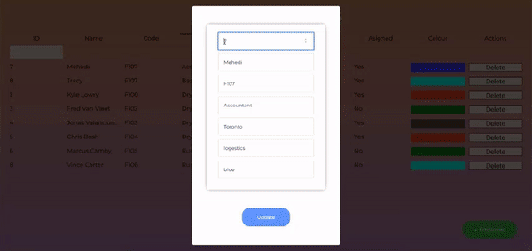

# Plexxis Interview Exercise

Hosted on Heroku at url: https://crud-code-test.herokuapp.com/

## Requirements

Create a simple but **impressive** (looks good, works well, has intuitive design, etc.) CRUD application that can do the following:

1. Retrieve employees from a REST API [✔]
2. Display the employees in a React application [✔]
3. Has UI mechanisms for creating and deleting employees [✔]
4. Has API endpoints for creating and deleting employees [✔]

## Bonus (Highly Encouraged)

1. Use a relational database to store the data (SQLite, MariaDB, Postgres) [✔]
2. UI mechanisms to edit/update employee data [✔]
3. Add API endpoint to update employee data [✔]
4. Use [React Table](https://react-table.js.org) [✔]

## Dev Notes:

- Started by moving everything from App to it's individual components
- Made Employees Component the top level component
- Loading spinner for when the data becomes larger and the content takes a while to load
- Updated API endpoints and cleaned up the server code a bit
- Added some CSS to make it look "better", considered using SCSS but didn't think it was needed for this scale.
- Right clicking on any of the rows should toggle the assigned.
- Dark theme option available
